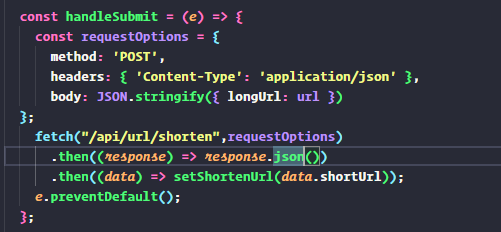
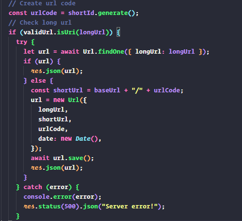
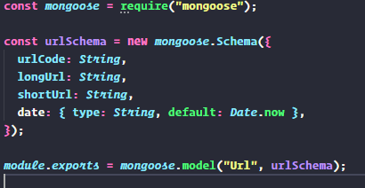
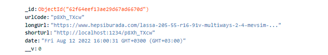
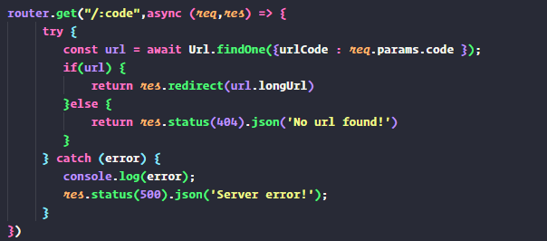

# URL SHORTENER

Proje'de 
database `mongodb`,
Backend `NodeJS`
Client `React`
Kullanılmıştır.

[Server - Github Link](https://github.com/talpidaex/url-shortener-server)

Kısaltmak istediğimiz url submit ederek, kısaltılmış olanı aldığımız bir servistir.

Inputtan aldığımız kısaltmak istediğimiz url'i "api/url/shorten" endpointine istek atarak eğer DB'de varsa kısaltılmış halini yoksa DB'ye kayıt ediyoruz.
#### Client Request

#### BackEnd Response
Server-side'da istek atılan url'in db'de kontrol ettirdiğimiz blok.

#### MongoDB Schema Oluşturulan Blok

DB olarak Cloud MongoDB tercih edildi. Backend ve mongoDB bağlantılarını
`/config/db.js` altında oluşturduk. Npm paketleri olarak mongoose kullanıldı.
Mongoose schema,model ve bağlantı kurarken ihtiyaclarımızı karşıladı.

Oluşturduğumuz model'a göre DB kayıtlarını tutuyoruz.

ShortURL linkini short-id npm paketi kullanarak ihtiyaç karşılanmıştır. Client'ta oluşturulan kısaltılmış url isteği ise server side'da
index.js dosyasında yazıldı. Yapılan get istekleri için;

 
 DB'de var ise, redirect yoksa 404 status code gönderiyoruz.

